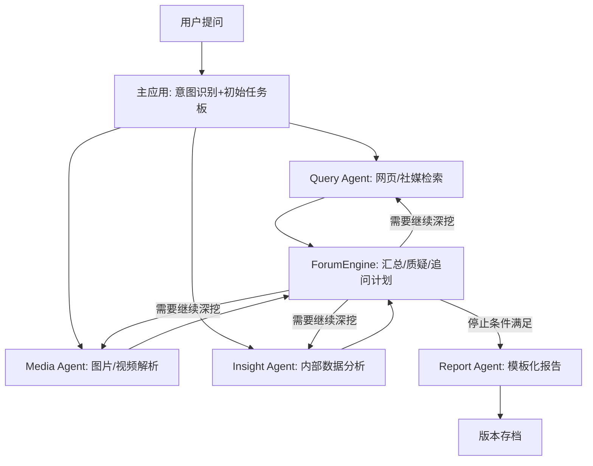

# 微舆（BettaFish）工具架构拆解

**版本**: v0.1.0  
**更新时间**: 2025-11-11

> 说明：遵循工作区规则——每次更新记得更新版本号；模块化开发，保持代码清晰。

## 项目概述（简述）
“微舆 / BettaFish”是一个多智能体协作的舆情分析系统：用户像聊天一样提出问题，系统并行启动多类 Agent（网页检索、图片/视频解析、内部数据库分析），在“论坛主持”机制下多轮讨论与反思，最终由报告 Agent 生成结构化研究报告。

## 核心模块
- 主应用（Flask 调度）
  - 职责：接收用户问题，解析意图，并行启动各 Agent，组织流程闭环。
  - 输入/输出：输入为用户问题与约束；输出为结构化报告。
- ForumEngine（论坛主持/协作）
  - 职责：在每一轮汇总中引导各 Agent 晒发现、提质疑、补证据，形成下一轮研究策略。
  - 特点：循环迭代，直到结论稳定、证据充分、边际收益低。
- Agents（智能体集合）
  - Query Agent：面向网页与社媒的检索与信息提取，支持下钻评论层。
  - Media Agent：多模态图片/短视频内容解析，提取结构化信息。
  - Insight Agent：内部/私有数据库分析，对比外部舆情，提供统计与趋势洞察。
  - Report Agent：按模板汇总所有结果，生成结构化报告（结论、依据、链接、图表、建议）。
- 工具集（Toolsets）
  - 搜索与爬虫适配器：对接通用搜索、新闻源、社媒平台；含速率限制与去重。
  - 多模态解析：视频/图片理解，提取关键标签/事件/情绪（可接第三方API）。
  - RAG/数据库：对接内部知识库与统计模型，支持私有数据分析。
- 数据层
  - 公域数据：微博/小红书/抖音/快手等社媒与网页内容。
  - 私域数据：企业内部数据库/知识库，安全合规地融合分析。
- 配置与运行
  - 配置驱动：平台列表、关键词、时间窗、排序权重、停止阈值。
  - 版本管理：每次改动递增版本号，报告与数据可回溯。

## 运行流程（文字版）
1. 用户提问；主应用接收并做意图识别，生成初始任务板（粗略计划）。
2. 并行启动 Query/Media/Insight 各 Agent 进行初步搜集与解析。
3. ForumEngine 汇总结果，提出质疑与冲突点，制定下一轮追问计划。
4. 多轮循环：各 Agent 深挖 → 论坛协作 → 反思修正，直到满足停止条件。
5. Report Agent 生成结构化报告，包含结论、证据链接、图表与建议；存档版本与原始索引。

## Mermaid 流程图

## 关键设计理念
- 并行初探 + 论坛迭代：先粗搜，再迭代，逐步提高结论质量。
- 复合分析引擎：不仅 LLM，还结合统计/微调等模型，提高稳健性。
- 模块化/可扩展：每个 Agent 独立职责，通过标准接口组合。
- 公私域融合：外部舆情 + 内部数据打通，为业务决策赋能。
- 合规与速率限制：遵守平台规则，控制抓取节奏与方式。

## 与当前最小方案（MVP）的对齐
- 我们当前仅保留 `Query Agent`（文本信息），实现“检索→清洗→排序→摘要→报告”的闭环。
- 预留扩展位：后续可逐步接入 `Media Agent`、`Insight Agent` 与多轮 `ForumEngine`。

## 术语对照
- 主应用 = Flask 主程序与调度
- 论坛主持 = ForumEngine
- C1/C2/C3 = Query/Media/Insight Agents
- 报告生成 = Report Agent

## 更新记录
- v0.1.0：新增架构拆解文档。