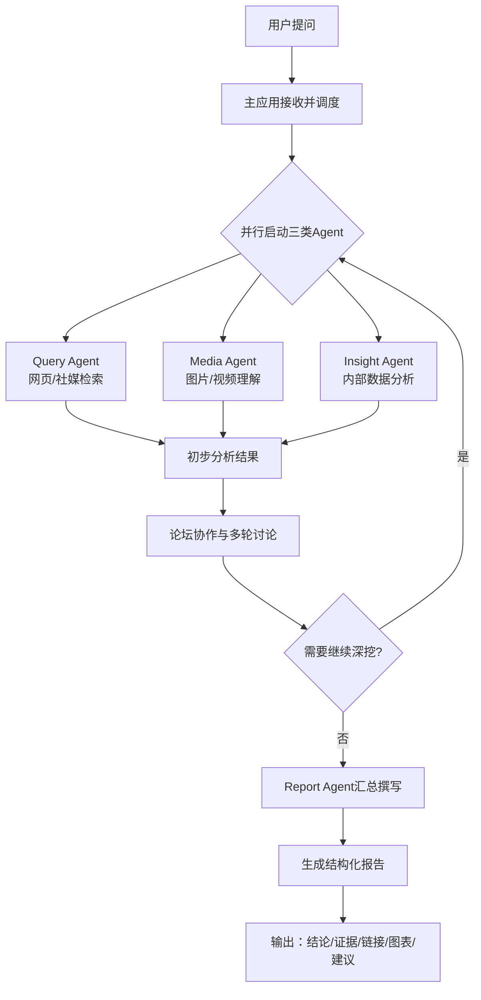

# 舆情分析系统说明

**版本**: v0.1.0  
**更新时间**: 2025-11-11

> 说明：遵循工作区规则——每次更新记得更新版本号；模块化开发，保持代码清晰。

## 一句话概述
这是一个“多智能体协作”的舆情分析系统：你提出问题，系统并行调用不同角色（搜索、看图视频、内部数据），多轮讨论后由撰稿人生成结构化报告。

## 模块化设计约定（简述）
- 主应用（调度）：接收问题，启动各 Agent，并管理流程循环。
- Query Agent：面向网页与社媒的检索与信息提取。
- Media Agent：图片/短视频内容解析，提取关键信息。
- Insight Agent：私有/内部数据库分析与洞察。
- Report Agent：汇总所有分析结果，生成结构化报告。
- Forum 协作：引导各 Agent 多轮讨论与反思，提升结论质量。

## 系统运行流程（文字版）
1. 用户提出分析问题（例如“某话题的舆情走势如何？”）。
2. 主应用接收并调度，按需并行启动 Query/Media/Insight 三类 Agent。
3. 各 Agent 完成初步检索/解析，产出阶段性结果。
4. 论坛协作机制发起多轮讨论：互相质疑、补证据、细化策略，必要时再次深挖。
5. 当结论足够扎实后，Report Agent 汇总撰写，按模板生成结构化报告。
6. 输出报告：包含结论、依据、链接、图表与行动建议。

## 简易流程图（Mermaid）


## ASCII 简化版
```
用户提问 -> 主应用调度 -> 并行启动3个Agent
           -> 初步分析 -> 论坛多轮协作(循环)
           -> Report Agent汇总 -> 生成结构化报告 -> 输出
```

## 更新记录
- v0.1.0：新建说明文档与简易流程图。